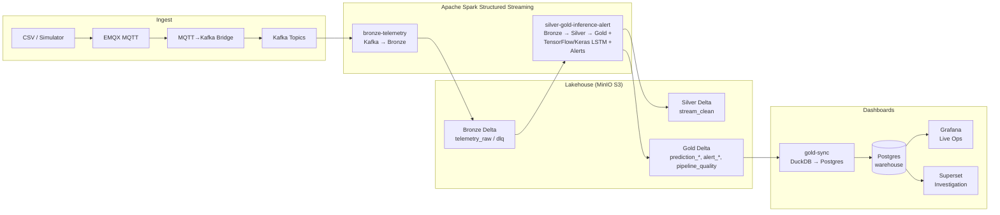
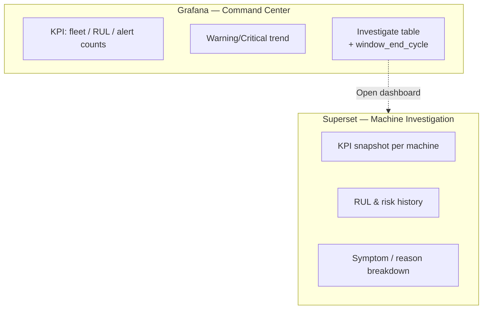

# Kiến trúc End-to-End — Predictive Maintenance (NASA CMAPSS FD001)

Tài liệu này mô tả **luồng dữ liệu, thành phần hệ thống và vai trò AI** để đội nhóm onboard, AI tooling vẽ sơ đồ, và làm khung bài thuyết trình.

---

## 1. Bối cảnh nghiệp vụ

- **Bài toán**: Dự đoán **Remaining Useful Life (RUL)** của động cơ turbofan từ chuỗi đo cảm biến theo chu kỳ (`time_cycles`).
- **Dataset**: NASA CMAPSS FD001 (30 đơn vị trong luồng demo).
- **Mục tiêu hệ thống**: Ingest telemetry realtime (hoặc replay), lưu trữ theo lớp **Bronze → Silver → Gold**, chạy **LSTM inference**, **cảnh báo theo risk + hysteresis**, và **quan sát** qua Grafana (ops) + Superset (điều tra từng máy).

---

## 2. Sơ đồ tổng quan (Mermaid)

### 2.1 Luồng dữ liệu chính

### 2.2 Phân tách vai trò quan sát

---

## 3. Các lớp dữ liệu (Medallion)

| Lớp | Lưu trữ | Nội dung | Ghi chú |
|-----|---------|----------|---------|
| **Bronze** | Delta trên MinIO | Payload thô + metadata Kafka; DLQ cho bản tin lỗi | Không business logic nặng |
| **Silver** | Delta | Chuẩn hoá kiểu, validate, dedup theo `(unit_nr, time_cycles)` | Nguồn cho inference |
| **Gold** | Delta | `prediction_history/current`, `alert_history/current`, `pipeline_quality` | BI-ready; sync sang Postgres |

**Đường dẫn MinIO (chuẩn trong compose)**: bucket `lakehouse`, prefix `bronze/`, `silver/`, `gold/`; checkpoint Spark ở bucket `checkpoints`.

---

## 4. Pipeline Spark (theo thứ tự phụ thuộc)

| Service (profile) | Script | Input → Output |
|-------------------|--------|----------------|
| `bronze-telemetry` (`bronze`) | `spark/stream_bronze_telemetry.py` | Kafka raw/DLQ → Delta Bronze |
| `silver-gold-inference-alert` (`ops`) | `spark/stream_silver_gold_inference_alert.py` | Đọc stream Bronze Delta → Silver → Gold + inference + alert |

**Ops** dùng image tùy chỉnh `Dockerfile.ops` (Python 3.11 + TensorFlow/Keras tương thích file `.keras`).

---

## 5. AI / ML trong luồng realtime

1. **Huấn luyện (ngoài luồng streaming, tùy chọn)**  
   - `NASA-Turbofan-Predictive-Modeling/`: training script + `model_GOLD_MINIO.keras`.  
   - `spark/build_train_silver_gold.py` (profile `train`): chuẩn bị Silver/Gold train trên MinIO từ `Data/train_history.csv`.

2. **Inference (trong Ops)**  
   - `InferenceEngine` đọc `train_history.csv` để **fit MinMaxScaler** và **baseline** cho symptom scoring (khớp preprocessing training).  
   - Cửa sổ **25 chu kỳ** (`SEQUENCE_LENGTH`) → tensor đưa vào **LSTM** (`model_GOLD_MINIO.keras`).  
   - Output: `predicted_rul`, `symptom_score`, `symptom_details_json`, ghi `prediction_history` và aggregate `prediction_current`.

3. **Alert**  
   - Risk từ `rul_score`, `trend_score`, `symptom_score` → mức Normal / Watch / Warning / Critical.  
   - **Hysteresis** (tránh nhảy mức): cần N lần liên tiếp trước khi đổi `alert_level` trong `alert_current`.

---

## 6. Tầng dashboard

| Thành phần | Vai trò |
|------------|---------|
| **gold-sync** | Định kỳ đọc Gold Delta (DuckDB + `delta_scan`) → `TRUNCATE` + append bảng trong Postgres `gold.*` + tạo view (`v_grafana_entrypoint`, `v_machine_snapshot`, …) |
| **Grafana** | Provisioned dashboard `PDM Gold Overview`: KPI fleet, trend cảnh báo, bảng điều tra nhanh |
| **Superset** | `bootstrap_dashboard.py` + `bootstrap_charts.py`: dashboard **Machine Investigation** (KPI, line, bảng, bar charts) |
| **refresh-superset** | Chạy `dashboard/superset/refresh_metadata.py` **sau khi** warehouse đã có bảng — tránh metadata rỗng |

**Luồng**: `MinIO Gold Delta → gold-sync → Postgres → Grafana / Superset`.

---

## 7. Docker Compose — profiles

| Profile | Mục đích |
|---------|----------|
| `core` | Kafka, Kafka UI, EMQX |
| `ingest` | Bridge MQTT → Kafka |
| `bronze` | MinIO + init, Bronze Spark |
| `ops` | Silver/Gold/Inference/Alert Spark |
| `dashboard` | Postgres, gold-sync, Superset, Grafana, superset-init |
| `train` | Job build train Silver/Gold trên MinIO (tách khỏi streaming) |

---

## 8. Cổng dịch vụ (host)

| Port | Dịch vụ |
|------|---------|
| 18831 | EMQX MQTT (map container 1883) |
| 18083 | EMQX Dashboard |
| 9092 | Kafka |
| 8080 | Kafka UI |
| 9000 / 9001 | MinIO API / Console |
| 5433 | Postgres (dashboard) |
| 3000 | Grafana |
| 8088 | Superset |

---

## 9. Thứ tự vận hành (tóm tắt)

1. `up-ingest` — core + bridge  
2. `up-bronze` — MinIO + Bronze streaming  
3. `replay` — đẩy CSV qua MQTT  
4. `up-ops` — Silver → Gold → inference → alert  
5. `up-dashboard` — warehouse + Grafana + Superset (init bootstrap)  
6. `refresh-superset` — sau khi gold-sync đã sync ít nhất một lần  

---

## 10. File tham chiếu nhanh

| Khu vực | File quan trọng |
|---------|-----------------|
| Orchestration | `run.ps1`, `docker-compose.yml`, `Dockerfile.ops` |
| Bronze | `spark/stream_bronze_telemetry.py` |
| Silver/Gold/AI/Alert | `spark/stream_silver_gold_inference_alert.py` |
| Train batch | `spark/build_train_silver_gold.py` |
| Ingest | `simulator/replay_mqtt_from_csv.py`, `simulator/mqtt_to_kafka_bridge.py` |
| Warehouse | `dashboard/gold_sync/sync_gold_to_warehouse.py` |
| Superset | `dashboard/superset/bootstrap_*.py`, `init_superset.sh`, `refresh_metadata.py` |
| Grafana | `dashboard/grafana/dashboards/overview.json` |
| Kiểm tra Gold | `duckdb_gold_check.sql` |

---

## 11. Gợi ý dùng cho bài thuyết trình (outline)

1. **Vấn đề**: predictive maintenance, RUL, dữ liệu sensor theo chu kỳ.  
2. **Kiến trúc**: ingest → lakehouse Delta → streaming analytics.  
3. **AI**: LSTM, cửa sổ 25 bước, alignment training/inference.  
4. **Alert**: risk score + hysteresis.  
5. **Quan sát**: Grafana tổng quan + Superset theo máy.  
6. **Demo**: replay CSV → chỉ ra Gold trên MinIO và dashboard.

---

*Tài liệu này phản ánh repo tại thời điểm tạo; khi đổi `docker-compose` hoặc pipeline, cập nhật mục tương ứng.*
